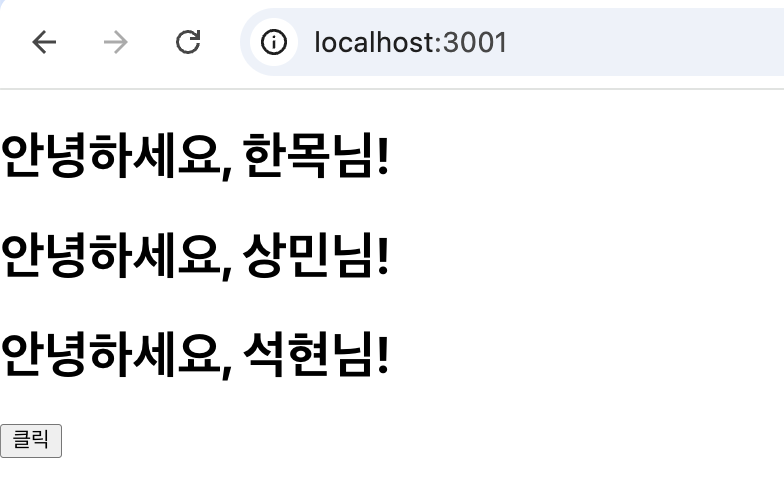
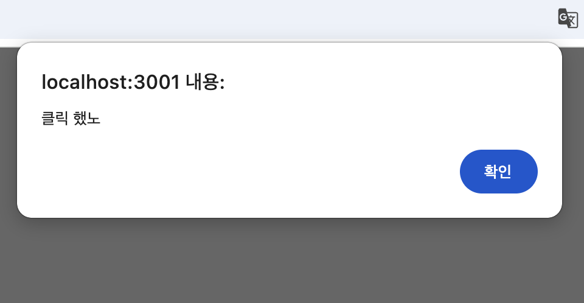
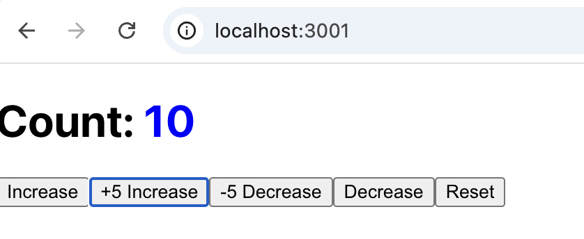
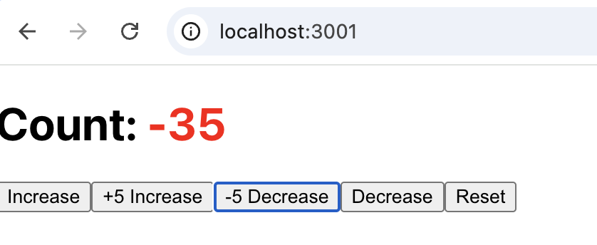
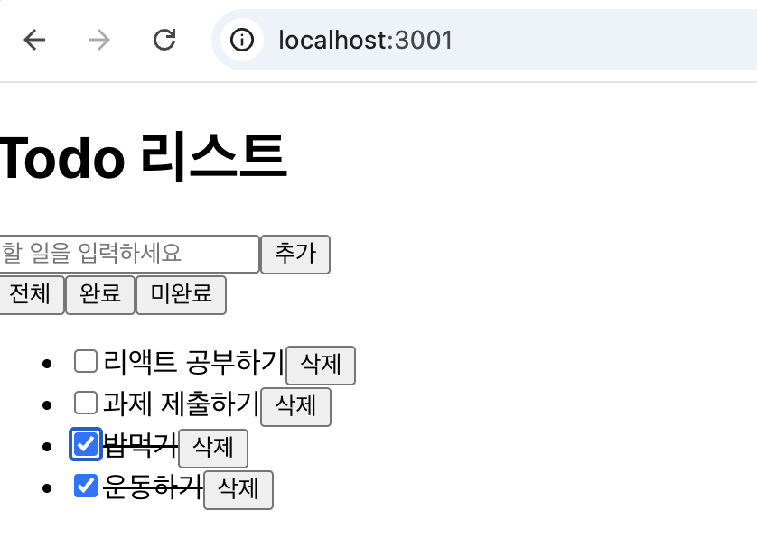
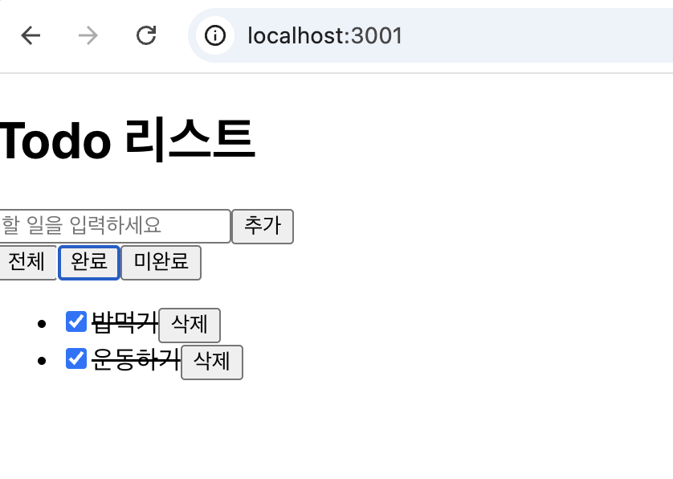
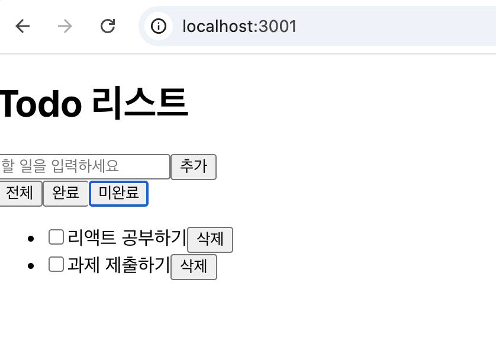
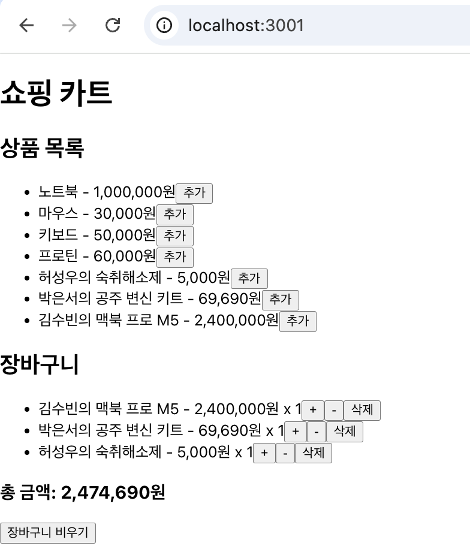

# 2주차 React 과제 제출 (jyhyo02)

## 기본 정보
- GitHub ID: `jyhyo02`
- 과제 폴더: `submissions/jyhyo02`

## 완료한 실습
- 실습 1: 컴포넌트 분리 (Welcome, Button)
- 실습 2: 카운터 앱 (state + 조건부 스타일)
- 실습 3: Todo 리스트 (추가/삭제/완료/필터)
- 실습 4: 프로필 카드 + 에디터 (props/state 연동)
- 실습 5: 쇼핑 카트 (복합 state 관리)

## 실행 방법 (공통)
각 실습은 개별 React 앱입니다. 실행하려는 폴더로 이동 후 명령어를 실행합니다.

```bash
cd submissions/jyhyo02/{practice-folder}
npm install
npm start
```

빌드 확인:

```bash
npm run build
```

---

## 실습 1: practice1-components
폴더: `practice1-components`

### 구현 내용
- `Welcome.jsx`
	- `name` props를 받아 인사 문구 출력
	- props가 없으면 기본값 `Guest` 처리
- `Button.jsx`
	- `text`, `onClick` props를 받는 버튼 컴포넌트
	- 기본 텍스트/기본 클릭 동작 제공
- `App.js`
	- `Welcome` 컴포넌트 여러 번 사용
	- `Button` 컴포넌트 렌더링

### 실행
```bash
cd submissions/jyhyo02/practice1-components
npm install
npm start
```

### 실행 결과



---

## 실습 2: practice2-counter
폴더: `practice2-counter`

### 구현 내용
- `Counter.jsx`
	- 기본 카운트 표시
	- `+1`, `-1`, `+5`, `-5`, `Reset` 버튼
	- count 값에 따른 조건부 색상
		- 음수: 빨간색
		- 10 이상: 파란색

### 실행
```bash
cd submissions/jyhyo02/practice2-counter
npm install
npm start
```
### 실행 결과




---

## 실습 3: practice3-todo
폴더: `practice3-todo`

### 구현 내용
- `TodoList.js`
	- Todo 추가 (입력창 + 버튼 + Enter 입력)
	- Todo 삭제
	- 완료 체크박스 토글
	- 완료 항목 취소선 표시
	- 필터링: 전체 / 완료 / 미완료

### 실행
```bash
cd submissions/jyhyo02/practice3-todo
npm install
npm start
```

### 실행 결과





---

## 실습 4: practice4-profile
폴더: `practice4-profile`

### 구현 내용
- `ProfileCard.jsx`
	- props: `name`, `email`, `avatar`, `bio`
	- 프로필 정보 출력
- `ProfileEditor.jsx`
	- 이름/이메일/소개 수정 폼
	- 이미지 파일 업로드(로컬 파일) 지원
	- 저장 시 `App`의 state 갱신
- `App.js`
	- profile state 관리
	- `ProfileCard` + `ProfileEditor` 연동
	- 기본 아바타: `src/Huh.jpg`

### 실행
```bash
cd submissions/jyhyo02/practice4-profile
npm install
npm start
```

### 실행 결과

---

## 실습 5: practice5-cart
폴더: `practice5-cart`

### 구현 내용
- `ShoppingCart.js`
	- 상품 목록 표시
	- 상품 추가
	- 장바구니 수량 증가/감소
	- 상품 삭제
	- 총 금액 계산
	- 빈 장바구니 메시지
	- 장바구니 비우기

### 실행
```bash
cd submissions/jyhyo02/practice5-cart
npm install
npm start
```

### 실행 결과


