### 이름: 신한목
### Practice1 ~ 5 완료
### 실행 방법: 각 React 디렉토리에서 npm install 후 npm start

---

## Practice1
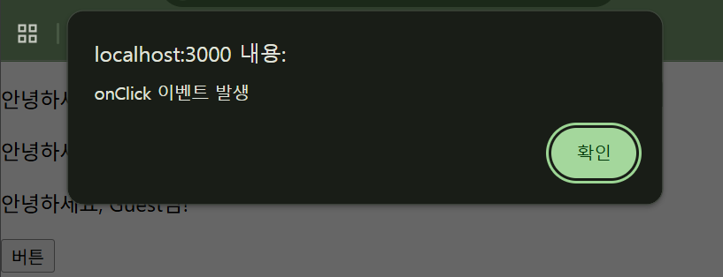

---

## Practice2

| -1 | 기본(0) | +10 |
|----|---------|-----|
| 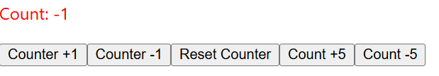 | 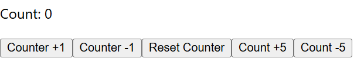 | 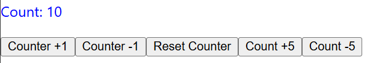 |

---

## Practice3

| All | Completed | Active |
|-----|-----------|--------|
| 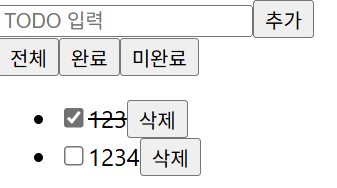 | 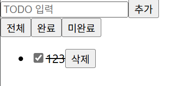 | 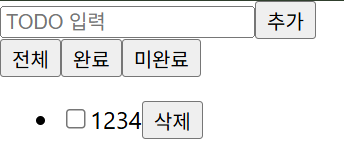 |

---

## Practice4

| 수정 전 | 수정 후 |
|--------|--------|
| 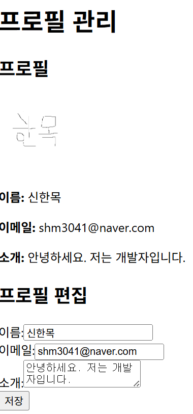 | 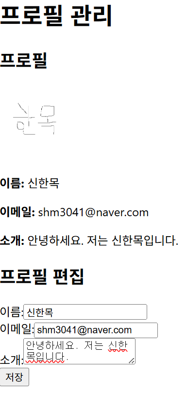 |

---

## Practice5

| 초기 화면 | 장바구니 추가 |
|----------|-------------|
| 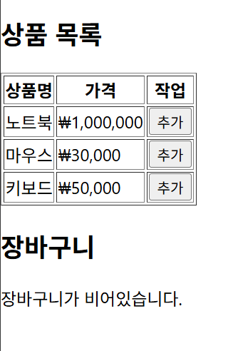 | 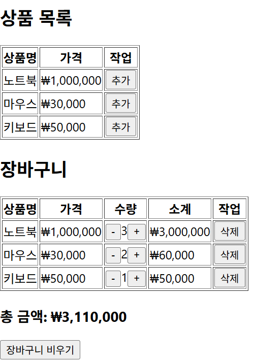 |